# Pizzeria Project
 This project was developed during the course of development with React and React Native by professor
 <a href="https://www.instagram.com/sujeitoprogramador/" style="text-decoration: none; color: #349beb">
     Matheus Fraga
    
 </a>
#
 ## What was made and learned at this course:

* Javascript basics to advanced
* Web development with <a href="https://github.com/facebook/react/" style="text-decoration: none; color: #349beb">ReactJS</a> and <a href="https://github.com/vercel/next.js" style="text-decoration: none; color: #349beb">NextJS</a>
* Backend development with NodeJS and Data Base
    - It is important say that we used the ORM  <a href="https://github.com/prisma" style="text-decoration: none; color: #349beb">Prisma Client</a>
* Mobile development with React Native

See below some screens of this project:

### 1. Web Part - Simulating the kitchen view

1.1. Login
 

1.2. SignUp

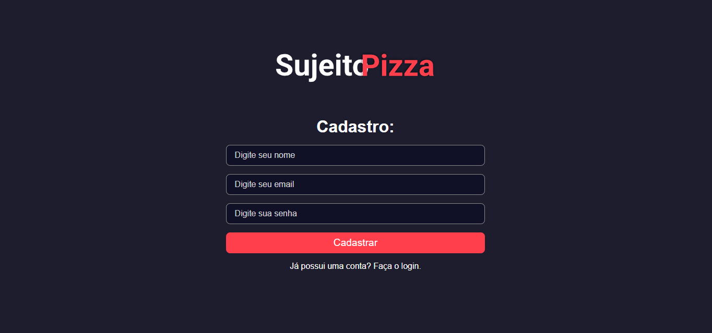

1.2. SignUp

1.3. Dashboard

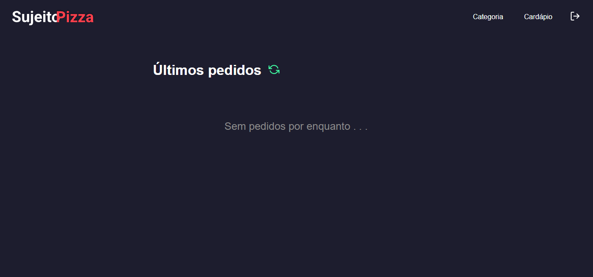

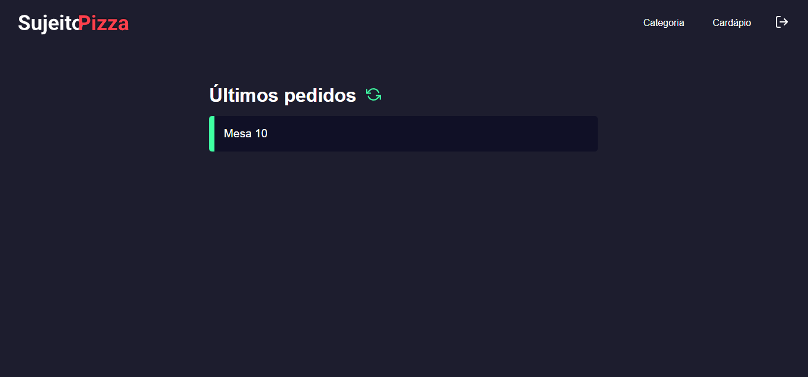

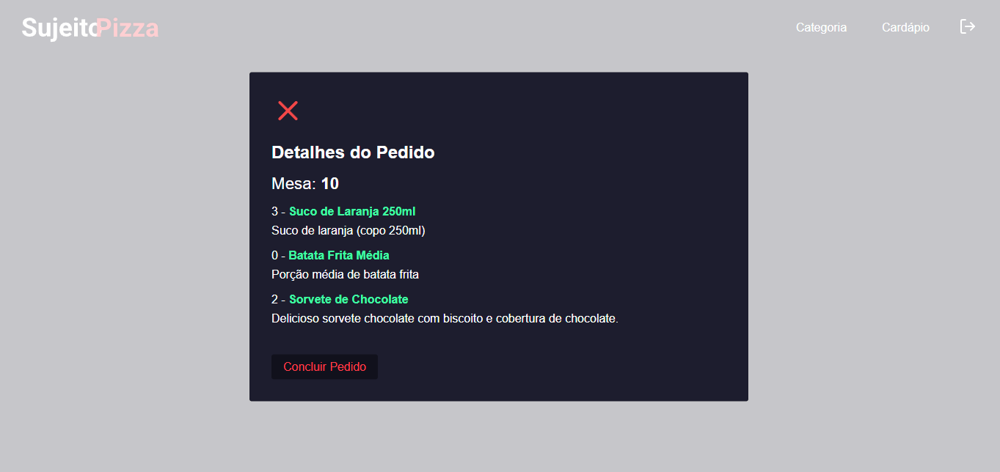

1.4. Create Category and Create Product

category
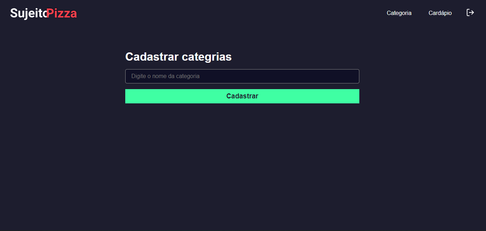

product
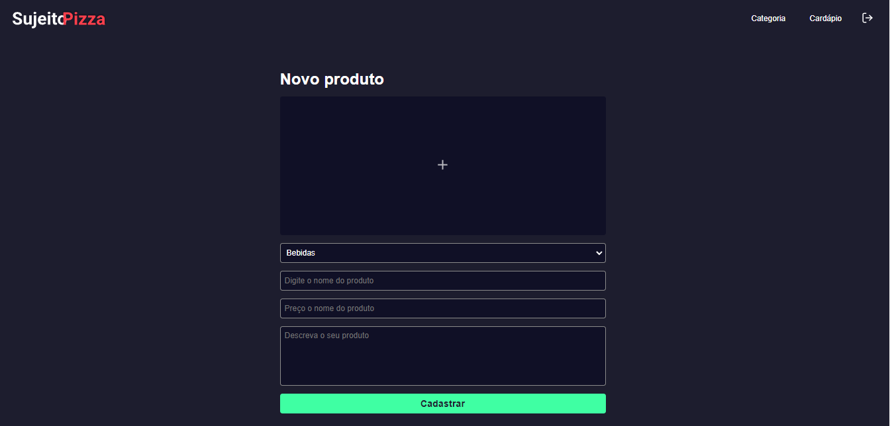 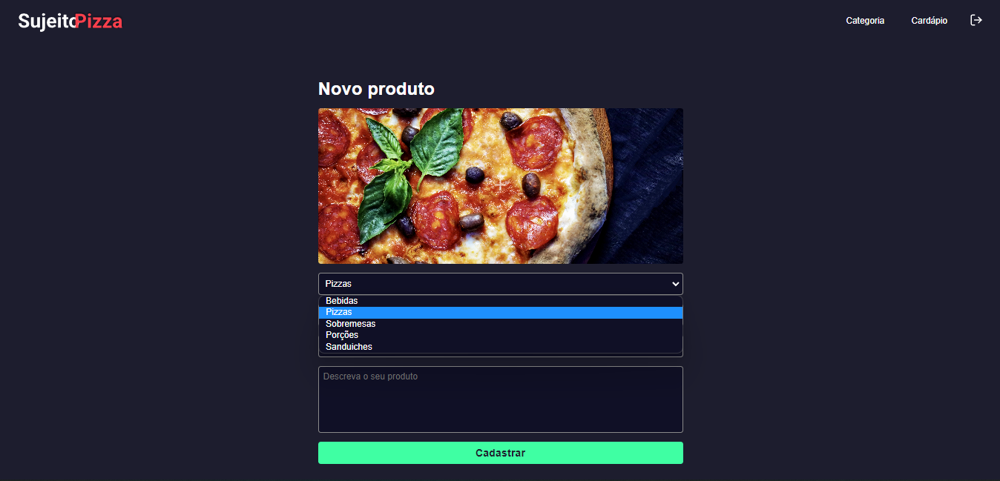

### 2. Mobile - Simulating the waiters view

2.1. Login
 

2.2. Order
 
 

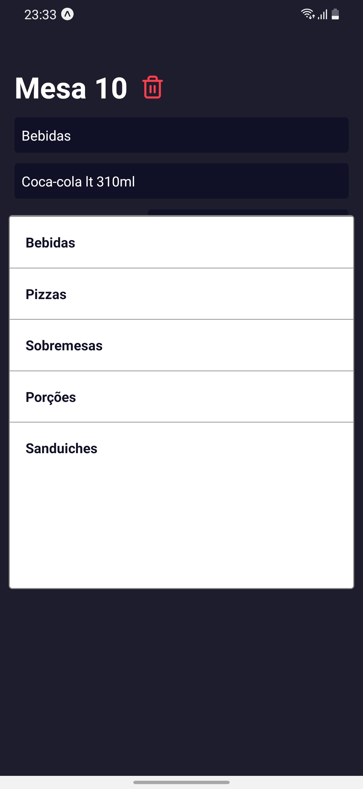
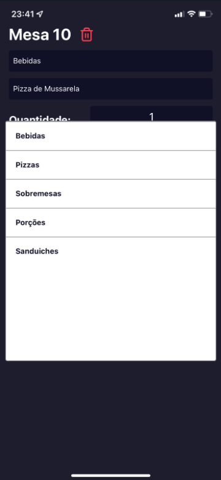

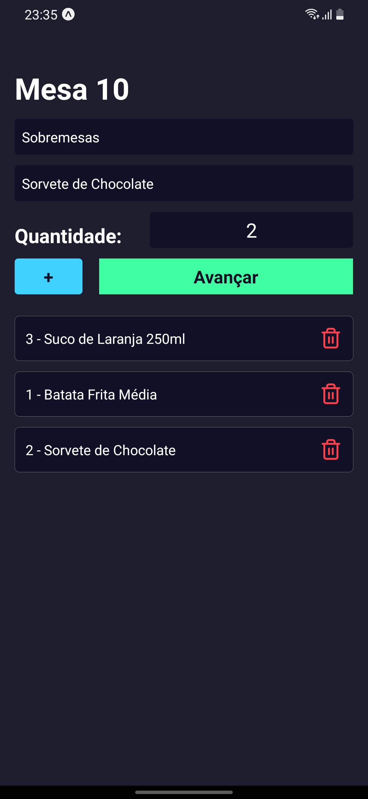
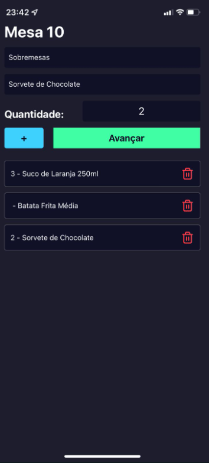

